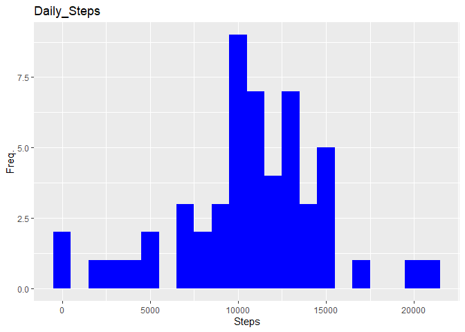
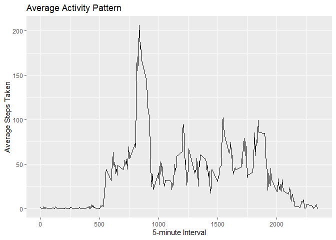
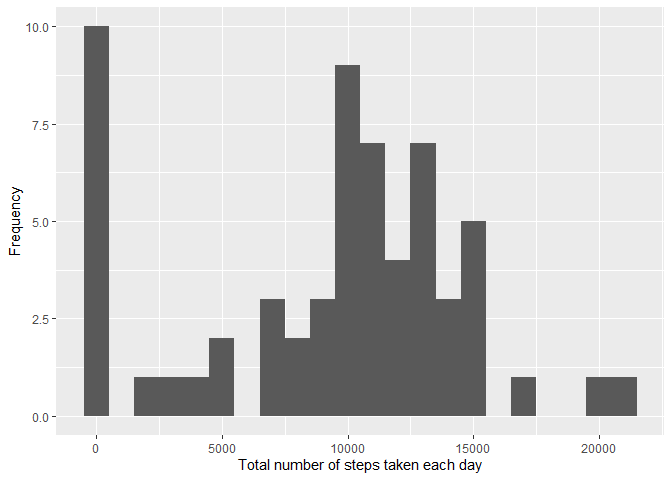
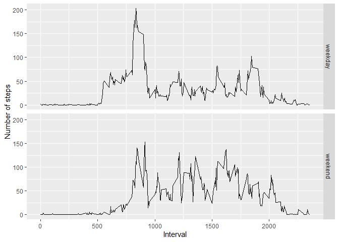

## Reading csv Data into Data.Table. 

```r
library("data.table")
library(ggplot2)
```

```
## Warning: package 'ggplot2' was built under R version 4.3.2
```

```r
activityDT <- read.table("activity.csv", sep=",", header=TRUE, na.strings="NA", stringsAsFactors=FALSE, nrow=17600)
head(activityDT)
```

```
##   steps       date interval
## 1    NA 2012-10-01        0
## 2    NA 2012-10-01        5
## 3    NA 2012-10-01       10
## 4    NA 2012-10-01       15
## 5    NA 2012-10-01       20
## 6    NA 2012-10-01       25
```

## (Q1)What is mean total number of steps taken per day?

1. Calculate the total number of steps taken per day


```r
library(dplyr)
```

```
## Warning: package 'dplyr' was built under R version 4.3.2
```

```
## 
## Attaching package: 'dplyr'
```

```
## The following objects are masked from 'package:data.table':
## 
##     between, first, last
```

```
## The following objects are masked from 'package:stats':
## 
##     filter, lag
```

```
## The following objects are masked from 'package:base':
## 
##     intersect, setdiff, setequal, union
```

```r
library(scales)
```

```
## Warning: package 'scales' was built under R version 4.3.2
```

```r
Total_Steps <- activityDT %>% group_by(date) %>% summarise(steps = sum(steps))

head(Total_Steps, 10)
```

```
## # A tibble: 10 × 2
##    date       steps
##    <chr>      <int>
##  1 2012-10-01    NA
##  2 2012-10-02   126
##  3 2012-10-03 11352
##  4 2012-10-04 12116
##  5 2012-10-05 13294
##  6 2012-10-06 15420
##  7 2012-10-07 11015
##  8 2012-10-08    NA
##  9 2012-10-09 12811
## 10 2012-10-10  9900
```

2. Make a histogram of the total number of steps taken each day. 


```r
ggplot(Total_Steps, aes(x = steps)) +
    geom_histogram(fill = "blue", binwidth = 1000) +
    labs(title = "Daily_Steps", x = "Steps", y = "Freq.")
```

```
## Warning: Removed 8 rows containing non-finite values (`stat_bin()`).
```

<!-- -->

3. Calculate and report the mean and median of the total number of steps taken per day

```r
meanStepsDay <- mean(Total_Steps$steps, na.rm = TRUE)
formatC(meanStepsDay, big.mark = ",", format = "f", digits = 0)
```

```
## [1] "10,766"
```

```r
medianStepsDay <- median(Total_Steps$steps, na.rm = TRUE)
formatC(medianStepsDay, big.mark = ",", format = "f", digits = 0)
```

```
## [1] "10,765"
```
## (Q2)What is the average daily activity pattern?

1. Make a time series plot (i.e. 𝚝𝚢𝚙𝚎 = "𝚕") of the 5-minute interval (x-axis) and the average number of steps taken, averaged across all days (y-axis)


```r
byInterval <- aggregate(steps ~ interval, activityDT, "mean")

qplot(interval, steps, data=byInterval, geom="line", xlab="5-minute Interval", ylab="Average Steps Taken", main="Average Activity Pattern")
```

```
## Warning: `qplot()` was deprecated in ggplot2 3.4.0.
## This warning is displayed once every 8 hours.
## Call `lifecycle::last_lifecycle_warnings()` to see where this warning was
## generated.
```

<!-- -->

2. Which 5-minute interval, on average across all the days in the dataset, contains the maximum number of steps?


```r
byInterval[which.max(byInterval$steps), 1]
```

```
## [1] 835
```


## (Q3)Imputing missing values

1. Calculate and report the total number of missing values in the dataset.


```r
sum(is.na(activityDT$steps))
```

```
## [1] 2304
```

2. Devise a strategy for filling in all of the missing values in the dataset. The strategy does not need to be sophisticated.


```r
# Filled the missing values with median of the dataset. 
library("tidyr")
```

```
## Warning: package 'tidyr' was built under R version 4.3.2
```

```r
activityDT <- activityDT %>% mutate(across(where(is.numeric), ~replace_na(., median(., na.rm=TRUE))))
```

3. Create a new dataset that is equal to the original dataset but with the missing data filled in.


```r
data.table::fwrite(x = activityDT, file = "new_activity.csv", quote = FALSE)

activityDT2 <- read.table("new_activity.csv", sep=",", header=TRUE, na.strings="NA", stringsAsFactors=FALSE, nrow=17600)
head(activityDT2)
```

```
##   steps       date interval
## 1     0 2012-10-01        0
## 2     0 2012-10-01        5
## 3     0 2012-10-01       10
## 4     0 2012-10-01       15
## 5     0 2012-10-01       20
## 6     0 2012-10-01       25
```

4. Make a histogram of the total number of steps taken each day and calculate and report the mean and median total number of steps taken per day. Do these values differ from the estimates from the first part of the assignment? What is the impact of imputing missing data on the estimates of the total daily number of steps?


```r
# total number of steps taken per day
activityDT2 %>% 
    group_by(date) %>% 
    summarise(ss = sum(steps)) %>% 
    ggplot(aes(x=ss)) + 
    geom_histogram(binwidth = 1000) + 
    xlab("Total number of steps taken each day") + 
    ylab("Frequency")
```

<!-- -->

```r
activityDT2 %>% 
  group_by(date) %>% 
  summarise(ss = sum(steps)) %>% 
  summarise(ms = mean(ss), meds = median(ss))
```

```
## # A tibble: 1 × 2
##      ms  meds
##   <dbl> <int>
## 1 9354. 10395
```
Type of Estimate | Mean_Steps | Median_Steps

Fillin in na with median | 9354.23 | 10395

## Are there differences in activity patterns between weekdays and weekends?

1. Create a new factor variable in the dataset with two levels – “weekday” and “weekend” indicating whether a given date is a weekday or weekend day.


```r
activityDT2 <- data.table::fread(input = "new_activity.csv")
activityDT2[, date := as.POSIXct(date, format = "%Y-%m-%d")]
activityDT2[, `Day_of_Week`:= weekdays(x = date)]
activityDT2[grepl(pattern = "Monday|Tuesday|Wednesday|Thursday|Friday", x = `Day_of_Week`), "weekday_or_weekend"] <- "weekday"
activityDT2[grepl(pattern = "Saturday|Sunday", x = `Day_of_Week`), "weekday_or_weekend"] <- "weekend"
activityDT2[, `weekday_or_weekend` := as.factor(`weekday_or_weekend`)]
head(activityDT2, 10)
```

```
##     steps       date interval Day_of_Week weekday_or_weekend
##  1:     0 2012-10-01        0      Monday            weekday
##  2:     0 2012-10-01        5      Monday            weekday
##  3:     0 2012-10-01       10      Monday            weekday
##  4:     0 2012-10-01       15      Monday            weekday
##  5:     0 2012-10-01       20      Monday            weekday
##  6:     0 2012-10-01       25      Monday            weekday
##  7:     0 2012-10-01       30      Monday            weekday
##  8:     0 2012-10-01       35      Monday            weekday
##  9:     0 2012-10-01       40      Monday            weekday
## 10:     0 2012-10-01       45      Monday            weekday
```

2. Make a panel plot containing a time series plot (i.e. 𝚝𝚢𝚙𝚎 = "𝚕") of the 5-minute interval (x-axis) and the average number of steps taken, averaged across all weekday days or weekend days (y-axis). See the README file in the GitHub repository to see an example of what this plot should look like using simulated data.


```r
activityDT2 %>% 
    group_by(interval,weekday_or_weekend) %>% 
    summarise(mi = mean(steps)) %>% 
    ggplot(aes(x=interval,y=mi)) + 
        geom_line() +
        xlab("Interval") + 
        ylab("Number of steps") +
        facet_grid(weekday_or_weekend ~ .)
```

```
## `summarise()` has grouped output by 'interval'. You can override using the
## `.groups` argument.
```

<!-- -->


The time series results indicate that activity is more spread out over the day during weekends than during weekdays.
